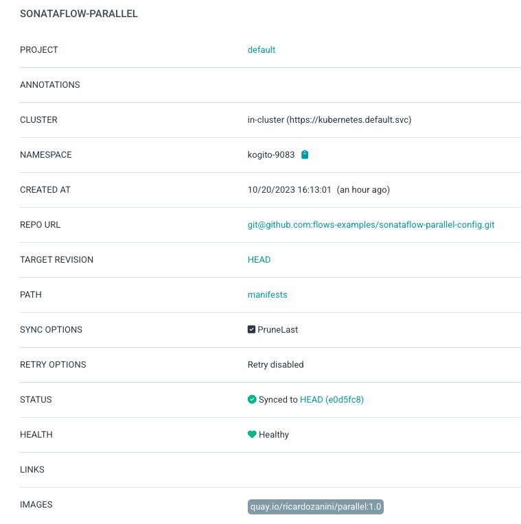
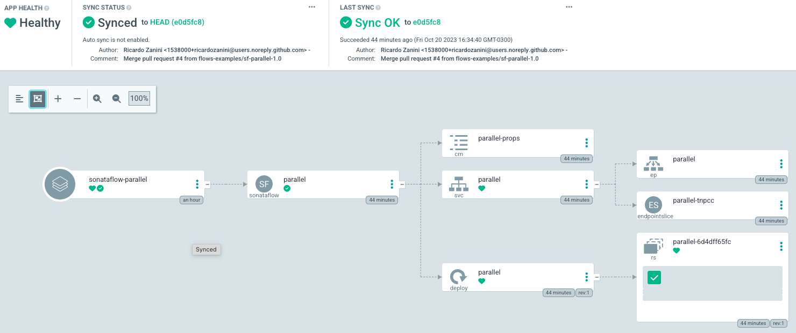
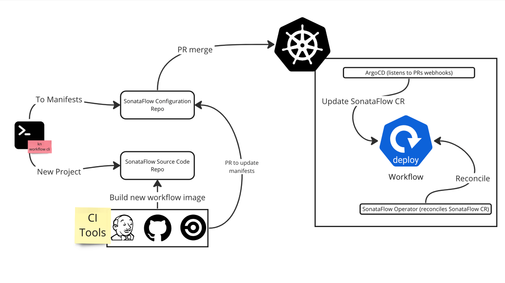

# GitOps Use Cases

Collection of GitOps use cases to use with [SonataFlow Operator](https://sonataflow.org/serverlessworkflow/latest/cloud/operator/install-serverless-operator.html).

## CI with Tekton

In this example, we show the possibility to build a "single file" SonataFlow project into an image. Later, this image can be used to deploy the workflow with the SonataFlow operator.

See [here for more details](ci/tekton//simple-build-kaniko/README.md).

## Integration with ArgoCD

The CI use case [Build with Kaniko and Generate Manifests](ci/tekton/02-build-kaniko-gen-manifest/README.md) is meant to integrate with a CD solution, such as [ArgoCD](https://argoproj.github.io/cd/).

This pipeline will fetch a [SonataFlow project repository](https://github.com/flows-examples/sonataflow-parallel), build the workflow image, push to a registry, generate an updated `SonataFlow` manifest, and open a PR to the [configuration repository](https://github.com/flows-examples/sonataflow-parallel-config).

From the configuration repository, ArgoCD will take over and use the generated manifests to deploy the workflow in the cluster.

The ArgoCD configuration is straightforward. The image below exemplifies the application:

When syncing the application with the configuration repository you can see the workflow deployed:

The [SonataFlow Operator](https://sonataflow.org/serverlessworkflow/latest/cloud/operator/install-serverless-operator.html) is responsible for the workflow deployment in the target cluster.

The figure below gives an overview of this CI/CD process:

## Video Explanation

